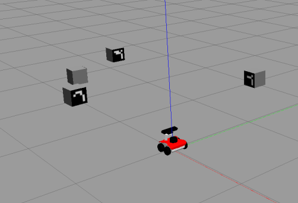
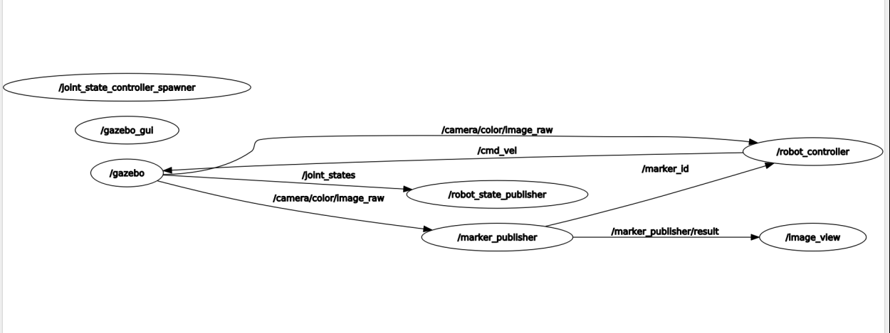
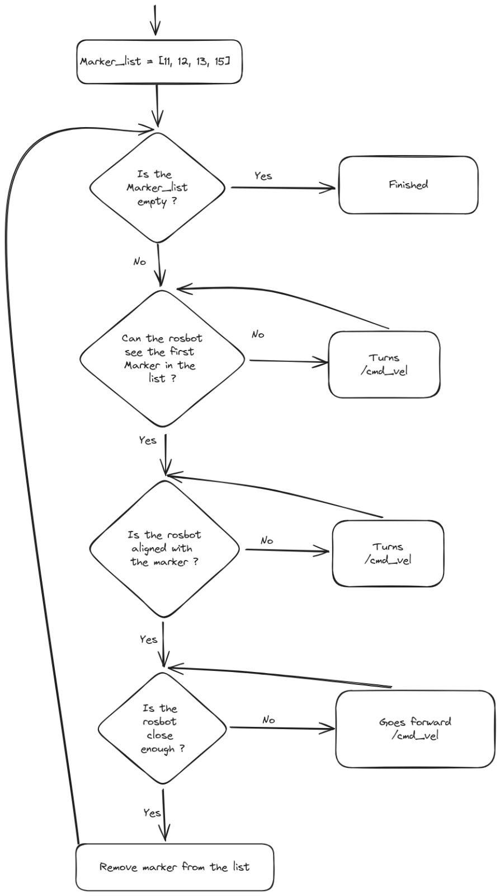

# 1st Assignment 

This repository contains our solution for the 1st assignment of the Experimental Robotics Lab course.

## Group Members:

- DELALA Hocine (5445123)
- GASMI Farouk (5473184)
- MONTANARO Alix (6523574)

## Overview

This repository contains an implementation of an assignment where a robot is tasked to navigate through an environment with Aruco markers. The goal is to make the robot move towards specific markers in a predefined order.



The robot must follow these behaviors:

- Find Marker 11 -> rotate until you find marker 12; then reach marker 12
- Marker 12 -> rotate until you find marker 13; then reach marker 13
- Marker 13 -> rotate until you find marker 15; then reach marker 15
- Marker 15 -> done!

## Implementation Details

### VIRTUAL ROBOT (GAZEB SIMULATION)

#### Marker Detection Node

For marker detection, we modified the marker publisher node in the `aruco_ros` package. The modifications enable the retrieval of marker information such as ID, center, and size. This information is published on the following topics:

- `/marker_id`: A topic that contains the ID of the detected marker.
- `/marker_center`: A topic that contains the center coordinates of the detected marker.
- `/marker_size`: A topic that contains the size of the detected marker.

This rqt Graph shows the ros nodes and their interactions:


#### Robot Control Node

The core of the control logic is implemented in the `simulation_robot_control` node within the `rosbot_gazebo` package in the script folder. This node subscribes to the marker information topics and controls the robot's movement accordingly.

#### Control Logic

When the code is launched, the robot starts spinning looking for marker 11. Once marker 11 is detected, the robot stops spinning and starts turning toward the marker until they are aligned. Once the robot and the marker are aligned, the robot moves forward toward the marker until a specific distance threshold. It stops, removes marker 11 from the marker list, as it is already reached, then it starts spinning looking for marker 12, and so on for the other markers. When the robot finds marker 15, the program ends.


In this node, the following functions have been implemented:

- **Searching State:** The robot is in a "searching" state until it detects the next marker in the predefined order.
- **Alignment:** Once the marker is detected, the robot aligns itself with the marker based on the marker's center and the width of the camera view.
- **Forward Movement:** After alignment, the robot moves forward until it is close enough to the marker.
- **Transition:** Upon reaching the marker, the robot transitions to the next marker in the predefined order.

More details about this node are in the following Flowchart:



### REAL ROBOT (ROSBOT)

For the real robot, a few changes have been made. The topic `/camera/control/image_raw` in both nodes (marker publisher and robot control) has been changed to `/camera/rgb/image_raw`. Other parts remain the same.

## How to Run & Results:

### Simulation Environment

1. Create and build a catkin workspace using the following command:

    ```bash
    mkdir -p ~/<name of the workspace, let say robot_ws>/src
    ```

2. Source your bashrc by adding the following line at the end of the bashrc file.

    ```bash
    source /where_your_workspace_is/devel/setup.bash
    ```

3. Clone these packages inside the /src of your workspace, using:

    ```bash
    cd /../robot_ws/src
    git clone https://github.com/hocinedl/Experimental_robotics_lab_1st_Assignment.git
    ```

4. Build the workspace:

    ```bash
    cd ~/robot_ws/
    catkin_make
    ```

5. Now you have everything installed and ready to launch. We have created two launch files inside the rosbot_gazebo package:

    - The first will launch the gazebo world (The robot and the markers), and the marker publisher node, we named it `environment.launch`.
    - The second one will launch the control node and the image_view node to see the output of the camera, we named it `control_robot.launch`.

    ```bash
    roslaunch rosbot_gazebo environment.launch
    roslaunch rosbot_gazebo control_robot.launch
    ```

**You should expect something like this after following the steps:**


### Real Robot

1. For the real robot, first, we need to connect it to a screen, mouse and typing board, so we can launch the nodes and do the configurations.
2. Connect the robot to a network, then check the IP address using `ifconfig`, then change the IP address in the .bashrc file.
3. Clone your package `aruco_ros` inside the `husarion_ws` (the control node of the real robot `real_robot_control.py` is inside the `aruco_ros/script` folder).
4. Catkin_make for the `husarion_ws`.
5. Launch the required nodes:

    ```bash
    roslaunch tutorial_pkg all.launch
    roslaunch aruco_ros real_robot.launch
    ```
    
**Here is the video when we tested our code on the rosbot robot:**


## Possible Improvements

- Add support for multiple rosbot robots working collaboratively.
- Dynamically generate the marker list based on the environment.
- We can improve the aruco markers detection such that when the robot is spinning to look for a marker, it saves the orientation of other markers, this will help the robot to specify the turning direction while looking for other markers. For instance, when the robot is spinning to find marker 11, it saves also the orientation of other markers, so when the robot reaches the marker 11, it knows which direction have to turn without making a 180degree turn, this will reduce the time to finish the task.
